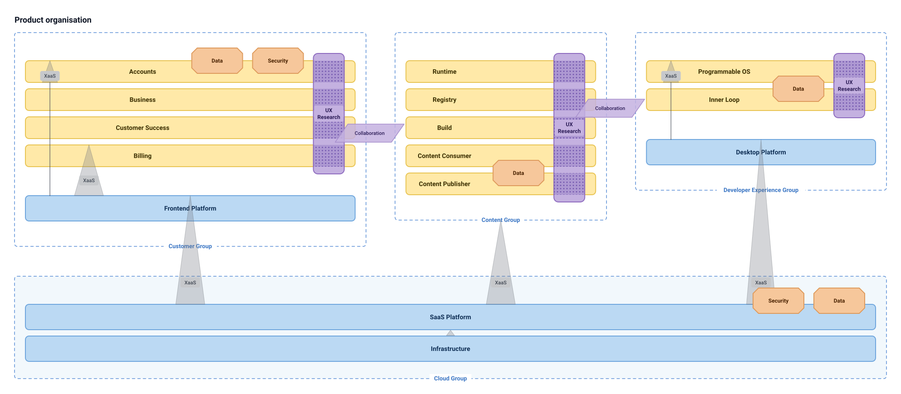

# teamtopo

A Mermaid-like text syntax for [Team Topologies](https://teamtopologies.com/key-concepts)
diagrams, and a zero-dependency renderer that turns it into SVG.

```
teamTopology
  title Checkout domain
  flow

  stream   checkout "Checkout"
  enabling devex    "DevEx"
  platform infra    "Infrastructure" {
    stream k8s "Kubernetes"
  }

  k8s   --> checkout : runtime
  devex ~~> checkout : CI coaching
```

Try it in the [playground](public/index.html) (open the file, or serve `public/`),
or from the command line:

```bash
node src/cli.js examples/ecommerce.tt > ecommerce.svg
cat diagram.tt | node src/cli.js --theme dark > dark.svg
node src/cli.js --json examples/ecommerce.tt     # the parsed model
```



## Why

Team Topologies has a small, precise visual vocabulary: four team types, three
interaction modes, and a handful of conventions (platforms at the bottom, flow of
change left to right, enabling teams drawn tall beside the streams they help).
Drawing those by hand in a diagramming tool is slow and the results drift from the
book's shapes. Mermaid showed that a small text language plus an opinionated
layout gets most people most of the way. This project applies the same idea
to team topologies.

## Hypothesis

A team-topology diagram can be described in a dozen lines of text and laid out
automatically well enough to be useful, because the domain constrains the layout
far more than a general graph does: team type decides the shape and the row, and
interactions are shapes that overlap teams rather than connectors between them.

## Syntax

The first non-comment line must be `teamTopology`. Comments start with `%%` or `//`.
Indentation is ignored.

### Teams

```
<type> <id> ["Label" | unquoted label] [attrs] [{]
```

| Keyword | Aliases | Team type | Shape |
|---|---|---|---|
| `stream` | `stream-aligned`, `sa` | Stream-aligned | full-width yellow lane, stacked in declaration order |
| `enabling` | `en` | Enabling | tall purple bar crossing the lanes it facilitates |
| `subsystem` | `complicated-subsystem`, `cs` | Complicated subsystem | orange octagon embedded on the lane it serves |
| `platform` | `pf` | Platform | full-width blue bar beneath the lanes |
| `group` | | Any other boundary | dashed frame, name on the bottom edge |

- `id` is `[A-Za-z_][A-Za-z0-9_.]*`. The label defaults to the id.
- Attributes are `key=value` pairs in square brackets: `[size=7, note="on call weekly"]`.
  `note` renders under the team name; `kind` labels a group's corner
  (e.g. `[kind="value stream"]`); everything else goes into the tooltip.
- `platform` and `group` may open a block with `{` and close it with `}` on its own line.
  Teams declared inside are laid out inside the container. A platform block is the
  book's *platform grouping*: a platform that is itself a topology of teams.

### Interactions

| Syntax | Mode | Meaning |
|---|---|---|
| `a <--> b` (or `<->`) | Collaboration | purple parallelogram bridging the two teams |
| `provider --> consumer` | X-as-a-Service | grey wedge, wide at the provider, pointed at the consumer |
| `consumer <-- provider` | X-as-a-Service | same, reversed |
| `enabler ~~> team` | Facilitating | dotted patch where the enabling bar crosses the team |
| `team <~~ enabler` | Facilitating | same, reversed |

The glyphs follow the book: the XaaS triangle, the collaboration parallelogram, the dotted
facilitating overlap. Unlabelled wedges read "XaaS" and unlabelled parallelograms read
"Collaboration", as they do in the reference diagrams.

Either side may be a comma-separated list: `infra --> checkout, search, accounts`.
A label follows a colon: `infra --> checkout : Kubernetes API`. Quote the label if it
contains `[`. Attributes come last in square brackets:

| Attribute | Effect |
|---|---|
| `[duration="until Q3"]` | fills the Duration column of the Team API tables |
| `[soon]` (or `[expected]`) | an interaction expected soon: drawn dashed and faded, listed under "teams we expect to interact with soon" |

```
devex ~~> checkout : CI pipelines [duration="until Q3"]
search <--> accounts : personalised results [soon, duration="8 weeks"]
```

### Directives

| Directive | Effect |
|---|---|
| `title Text` | diagram title |
| `flow [Text]` | flow-of-change arrow across the top (default text "Flow of change") |
| `legend` | key for shapes and interaction modes |

### Team API blocks

```
api checkout {
  focus: the checkout experience end to end
  software: checkout-service, cart-ui
  SLE: 99.9% availability, p95 < 300 ms
  chat: #checkout #checkout-alerts
  working on: migrating to the new payments API
}
```

An `api` block holds the [Team API](#team-api) fields the diagram cannot infer, as
`field: value` lines. Field names are matched loosely (`SLE`, `sle`, `Service Level
Expectations` all work; the full list is in `TEAM_API_FIELDS`). Inside an `api` block
only `%%` starts a comment, so URLs with `//` survive.

### Errors

Parse errors carry a line number and a message. The playground highlights the line.

```
Line 12: unknown team "infra"
Line 20: "k8s" and "cloud" are nested; a team cannot interact with its own container
```

## Layout

The layout is not a general graph layout. It reproduces the conventions of the
Team Topologies book, so the domain does most of the work:

1. **Lanes.** Stream-aligned teams are full-width lanes stacked top to bottom in
   declaration order. Platform teams are full-width bars beneath them. Declaration
   order is the only ordering control, on purpose: it is predictable.
2. **Overlays.** Enabling teams are tall bars placed in their own column on the right,
   spanning from the first to the last team they facilitate and overlapping each one;
   the overlap is drawn as a dotted patch. Complicated-subsystem teams are octagons
   embedded on the top edge of the first lane they provide a service to, in their own
   column; that embedding *is* the X-as-a-Service relationship, so no wedge is drawn
   for it.
3. **Wedges.** Every other X-as-a-Service is a grey wedge with its wide base on the
   provider and its point reaching the far edge of the consumer, so the wedge covers
   it. A fan-out (`infra --> a, b, c`) is one wedge that reaches the farthest consumer
   and covers the ones between, with a wider base, as in the book. Wedges from a
   platform to lanes get a reserved column on the left of the lane labels, so they can
   pass through intermediate lanes. Wedges between frames pick a free
   column in the horizontal overlap of the two boxes.
4. **Frames.** Groups and platform groupings are dashed frames laid out with the same
   rules, recursively. Frames of streams sit side by side; platform groupings stretch
   to full width beneath. Overlays declared at a level with no lanes of their own get a
   column beside the frames, and facilitating that cannot cross a team is drawn as a
   dotted band to it.
5. **Canvas.** Anything that overflows the structural content grows the canvas.

To keep a subsystem or enabling team on the lanes it belongs with, declare it in the
same block as those lanes.

## Team API

Team Topologies suggests every team publish a *Team API*: a short document telling
other teams how to interact with it (book pp. 47-49). The
[Team-API-template](https://github.com/TeamTopologies/Team-API-template) repository
gives it a standard shape. A diagram already knows most of what that template asks
for, so `teamtopo` generates one document per team from the diagram:

```bash
node src/cli.js --api examples/ecommerce.tt                  # every team, Markdown
node src/cli.js --api --team checkout examples/ecommerce.tt  # one team
```

| Template field | Where it comes from |
|---|---|
| Team name and focus | the team's label, plus `focus` from its `api` block |
| Team type | the team keyword |
| Part of a Platform? | whether the team is declared inside a `platform { }` block, plus `platform` from the `api` block |
| Do we provide a service to other teams? | outgoing `-->` interactions and their labels, plus `service` |
| Service Level Expectations, software, versioning, wiki, chat, sync | the `api` block (`sle`, `software`, `versioning`, `wiki`, `chat`, `sync`) |
| What we're currently working on | `working on`, `ways of working`, `improvements` |
| Teams we currently interact with | every interaction touching the team: the other team, the mode with direction ("we provide" / "we consume", "we facilitate" / "they facilitate us"), the label as Purpose, and `duration` |
| Teams we expect to interact with soon | the same, for interactions marked `[soon]` |

Fields the diagram cannot fill stay blank, so the output is still a fillable template.
In the playground, click any team to see its Team API and copy the Markdown.

The document layout follows the Team API template by Team Topologies, licensed
[CC BY-SA 4.0](https://creativecommons.org/licenses/by-sa/4.0/).

## API

```js
import { parse, layout, render, teamApi, teamApis } from './src/teamtopo.js';

const model = parse(source);              // { title, flow, legend, nodes, teams, interactions, index }
const lay = layout(model);                // { width, height, boxes, edges, ... }
const svg = render(source, { theme: 'dark' });   // or render(model, opts)
const md = teamApi(model, 'checkout', { date: '2026-01-02' });   // one Team API document
const all = teamApis(model);              // [{ id, label, markdown }] for every team
```

`render` options: `theme` (`'light'`, `'dark'`, or a theme object), `legend` (override the
directive), `idPrefix` (when several diagrams share a page), `fontFamily`.

`layout` returns absolute boxes per team plus one geometry per interaction
(`wedge`, `bridge`, `patch` or `band`), which is what the tests assert against.

## Agent Skill

`skills/teamtopo/` is an [Agent Skill](https://agentskills.io) that teaches Claude Code
and similar harnesses the `.tt` syntax, the layout rules, the common edits (split a
team, add a platform, mark an interaction `[soon]`) and how to validate with the CLI, so
you can draft and evolve a topology from your terminal ("split checkout into two
stream-aligned teams" → `org.tt` updated and parsing).

Install it into a project with the [skills CLI](https://github.com/vercel-labs/skills):

```bash
npx skills add jrschumacher/teamtopo                          # pick agents interactively
npx skills add jrschumacher/teamtopo --skill teamtopo -a claude-code -y
```

Or copy it by hand: put the directory at `.claude/skills/teamtopo/` in your project
(or `~/.claude/skills/teamtopo/` for every project):

```bash
git clone --depth 1 https://github.com/jrschumacher/teamtopo /tmp/teamtopo
mkdir -p .claude/skills && cp -r /tmp/teamtopo/skills/teamtopo .claude/skills/
```

`SKILL.md` has three entry points (model an organisation from a description or the
repo, evolve an existing file, review a file for health) plus the parser rules;
`references/` holds the modeling guidance (vocabulary translation, patterns by org
shape, interaction evolution), the discovery and Team API question scripts, a smell
checklist, edit recipes, the full syntax and layout rules, and validation commands.
Every `.tt` snippet in the skill is parsed by `npm test`, so the docs cannot drift from
the grammar. Until the npm package ships (#2), the skill validates with
`node src/cli.js --json file.tt` inside this repository or
`npx --yes github:jrschumacher/teamtopo --json file.tt` elsewhere.

## Articles

`content/articles/*.md` are long-form articles built into a small static site with
the same zero-dependency approach as the rest of the project:

```bash
npm run articles                                     # → public/articles/
node scripts/articles.mjs --out dist/blog --base /blog   # from another build, e.g. the hosted app
```

The build writes `<out>/<slug>/index.html` per article (slug = filename without
`.md`), `<out>/index.html` listing non-draft articles newest first, and
`<out>/feed.xml` (RSS 2.0). Markdown is rendered by `scripts/markdown.mjs`
(headings with ids, lists, tables, fenced code, blockquotes; raw HTML is escaped).
A fenced block tagged ` ```teamtopo ` is rendered through `render()` into inline SVG;
a diagram that fails to parse fails the build, naming the article and line.

Each article starts with a front matter block:

```
---
title: Agentic Teams on Team Topologies
date: 2026-09-05
author: Ryan Schumacher
summary: One sentence, used for the listing, meta description and feed.
tags: team-topologies, ai-agents, org-design
draft: true        # optional; still built, but left out of the index and feed
---
```

`title`, `date` (YYYY-MM-DD), `author`, `summary` and `tags` (comma-separated) are
required. The title is rendered from front matter, so the body should start at `##`.

## Files

```
teamtopo/
├── src/teamtopo.js        parser, layout, renderer (single ES module, no deps)
├── src/teamtopo.test.js   node --test
├── src/cli.js             file or stdin → SVG
├── src/playground.html    playground template (library inlined at build time)
├── build.js               → public/index.html, public/teamtopo.js, examples/*.svg
├── scripts/articles.mjs   articles build (+ markdown.mjs, article-template.mjs, tests)
├── content/articles/*.md  articles with front matter
├── examples/*.tt          sample diagrams (+ rendered .svg)
├── skills/teamtopo/       Agent Skill: SKILL.md + references/ (syntax, layout, edits, validation, examples)
├── public/                static playground, self-contained
├── app/                   hosted SPA + Worker (Vite, D1, R2); see docs/app-intent.md
└── docs/                  app intent, landing design contract, follow-ups
```

```bash
npm test          # run the tests
npm run build     # rebuild public/ from src/
npm run examples  # rebuild public/ and re-render examples/*.svg
npm run articles  # build content/articles/ → public/articles/

cd app
npm run dev       # hosted app locally (local D1/R2 via wrangler)
npm run check     # typecheck + lint + tests
npm run deploy    # build, migrate the remote D1, deploy (CI does this from main)
```

## Findings

- The first version treated this as a graph layout problem (nodes in rows, edges
  routed between them) and produced tidy diagrams that did not look like Team
  Topologies diagrams at all. The book's visual language is a *lane* language:
  interactions are drawn as shapes that overlap the teams, not as connectors. Once
  the layout was rebuilt around lanes and overlays, a dozen lines of syntax
  reproduced the canonical organisation diagram closely (see `examples/org-groups.tt`).
- With lanes, ordering stops being a search problem. Declaration order is enough and
  is easier to reason about than any automatic reordering.
- The hard cases are cross-frame interactions: a wedge from one group's platform to
  another group, or an enabling team declared outside the lanes it helps. Those fall
  back to geometry between the two boxes and are legible but not pretty.
- Text width is estimated per character class since there is no canvas in Node.
  Labels stay inside their shapes at the default fonts but the estimate is not exact.
- The largest example renders in well under 50 ms in Node.

## Limitations and ideas

- No `direction LR` yet; the book's convention is lanes with flow left to right, and
  that is all this does.
- Wedges pass through intermediate lanes rather than around them, as in the book.
  Very tall stacks with many platform-to-top-lane wedges get busy.
- Enabling bars cannot cross lanes in a different frame; those facilitations become
  dotted bands.
- Possible next steps: team-size and cognitive-load annotations, "as-is / to-be"
  pairs rendered side by side, a Mermaid plugin so this can live in Markdown fences,
  and a Graphviz-quality crossing reduction for larger organisations.

The shapes and colours follow the Team Topologies
[team shape templates](https://github.com/TeamTopologies/Team-Shape-Templates)
(CC BY-SA 4.0), approximated rather than copied.

## License

MIT. See [LICENSE](LICENSE).

<!-- build bump: 1 -->

