# Shape gallery: how teamtopo draws complex organisations

Spike branch `spike/shape-gallery` off `feat/enabling-rail` (merged with `feat/edge-labels`).
Fourteen synthetic `.tt` fixtures, each rendered light and dark, screenshotted at 1600×1100
with `agent-browser`, and read closely for how the layout holds up once a diagram stops
being a single value stream. Every finding below is from the actual render, not a guess —
`.tt` sources and both-theme `.svg`/`.png` pairs sit alongside this file (dark renders under
`dark/`, PNG screenshots suffixed `.dark.png`).

None of the fixtures are `platform-grouping`- or `ecommerce`-style happy paths already
covered by `examples/`; they specifically target the places Ryan flagged: shared components,
platform avoidance, in-group crowding, org-alignment vs. flow, matrices, layering, scale, time,
and cross-boundary collaboration.

## Verdict table

| Fixture | Structure (one sentence) | Verdict | Problem, in one line |
|---|---|---|---|
| [`subsystem-shared`](subsystem-shared.tt) | One complicated subsystem serving a lane in each of three sibling groups | **misleading** | Embedding is Y-aligned to its first target but X-fixed to a far-away overlay column, so the subsystem visually floats beside the *last* group, not the first it serves |
| [`platform-column`](platform-column.tt) | One root-level platform bar consumed by lanes in three sibling groups | fine | Works cleanly; only flaw is four redundant unlabelled "XaaS" plates |
| [`platform-as-group`](platform-as-group.tt) | Same org, platform modelled as a `group` of streams beside its consumers | **ugly** | Every platform stream fans out individually; wedges stack and gray out the neighbouring group's lane text |
| [`enabling-crowding`](enabling-crowding.tt) | One enabling team facilitating five lanes in its own group | fine | Legible today; height scales one row per lane so it is really a "does this still work at N=12" question, not yet broken |
| [`team-owns-streams`](team-owns-streams.tt) | One team's three streams, named via a group label and a `note=` on each lane | **misleading** | Renders as three separate stream-aligned teams; nothing in the shape says "one team" |
| [`alignment-vs-flow`](alignment-vs-flow.tt) | A tribe/reporting group whose lane flows into a sibling tribe | **misleading** | No visual channel for "reporting line" at all; two wedges collide at the tribe boundary and the org-alignment idea never appears |
| [`nested-three-deep`](nested-three-deep.tt) | Tribe > area > stream, three levels of `group` nesting | fine | Nests and labels cleanly; no problem found |
| [`xaas-matrix`](xaas-matrix.tt) | 3 providers × 3 consumers, nine distinct XaaS dependencies | **misleading** | Same-provider wedges silently collapse to one wide wedge per provider; nine relationships read as three broad "coverage" sweeps over unrelated intermediate lanes |
| [`platform-on-platform`](platform-on-platform.tt) | Infra platform → app platform → two consumer lanes | fine | Legible; the platform-to-platform wedge is a little stubby/cramped but the layering reads correctly |
| [`enabling-facilitates-leaves`](enabling-facilitates-leaves.tt) | One enabling team facilitating one specific lane in each of three sibling groups | **misleading** | The three targets happen to be top lanes, so the fallback geometry paints one continuous dotted band across all three frames — visually indistinguishable from "facilitates the whole row," exactly the reading the rail (#22) exists to avoid |
| [`large-org`](large-org.tt) | 32 teams across 6 groups, with a subsystem, a platform, and an enabling rail | fine, with caveats | Renders without crashing or clipping content, but canvas width grows unbounded (≈2200px for 6 groups) and cross-group wedges + a full-width rail create real visual noise |
| [`time-as-is`](time-as-is.tt) / [`time-to-be`](time-to-be.tt) | Same org, `[soon]` interaction added for the to-be state | fine | `[soon]` dash/fade reads correctly; only wrinkle is no syntax to mark an interaction as *retiring*, only arriving |
| [`collab-xaas-same-pair`](collab-xaas-same-pair.tt) | Collaboration and XaaS between the same two lanes, across a group boundary | **misleading (severe)** | The collaboration parallelogram paints over the XaaS wedge's label — "event pipeline" is parsed, present in the SVG DOM, and 100% invisible under the collaboration shape |

## Findings in depth

### 1. `subsystem-shared` — shared complicated subsystem
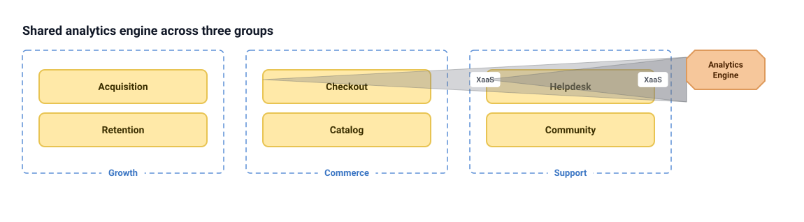
`analytics --> acquisition` (Growth), `--> checkout` (Commerce), `--> helpdesk` (Support).
The renderer embeds a subsystem's box at the Y position of its *first* XaaS target but the
X position of its own overlay-column slot — which for a root-level subsystem is the rightmost
column, beside whichever group happens to be declared last. Result: "Analytics Engine" sits
visually next to Support/Helpdesk even though the embedding relationship (no wedge drawn) is
actually with Growth/Acquisition, the first line in file order. The two remaining targets
become individual "XaaS"-labelled wedges that cross two frame boundaries and overlap Catalog
and Community's boxes.
**Proposed treatment:** the exact shared-rail idea Ryan asked about — a subsystem consumed by
2+ sibling frames should get a horizontal rail below (or above) the frame band, the same
device rule 8b already uses for enabling teams, instead of a floating octagon plus loose wedges.
**Acceptance criteria:**
1. A subsystem with XaaS targets in ≥2 sibling top-level frames renders as one rail spanning
   leftmost-to-rightmost target frame, not an embedded octagon plus wedges.
2. The rail's screen position does not depend on file order of its `-->` lines.
3. A subsystem with a single target, or targets inside one frame, keeps today's embed treatment
   (no regression to the common case).

### 2 & 3. `platform-column` vs `platform-as-group` — why people avoid the `platform` block
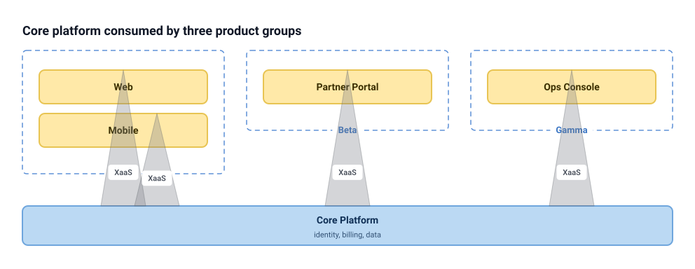
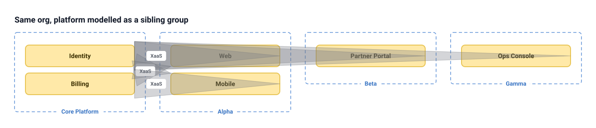
The `platform` block (fixture 2) is unambiguously better: one blue bar, four converging wedges,
nothing overlaps. Modelling the same platform as a `group` of streams (fixture 3) — which people
do when they want the platform's internals to show, or when a real "platform team" needs to
look like a team rather than a container — produces four separate stream-to-stream wedges that
overlap each other, gray out "Web" and "Mobile" text, and cross two more frame boundaries to
reach Beta and Gamma. This is the clearest "cost of avoiding platform" evidence in the gallery.
**Proposed treatment:** when a `group`'s streams collectively XaaS-provide to every stream in
several sibling frames (a group-level fan-out, not a single lane's), collapse to one wedge (or
rail) per *group* pair the same way same-provider-same-label wedges already collapse — i.e.
extend the existing wedge-grouping key from `(from, label)` to also group by common `(fromGroup,
label)` when every lane in a frame provides the same thing.
**Acceptance criteria:**
1. Two or more lanes in the same group providing XaaS to the same consumer set with the same
   label render as one wedge from the group's frame, not N overlapping lane-level wedges.
2. Consumer lane text is never occluded (rendered opacity of any wedge over lane text stays
   below the threshold that fails a contrast check, or the wedge routes around the lane).
3. `platform-column` and this collapsed `platform-as-group` render visually equivalent modulo
   the container shape (bar vs. dashed frame).

### 4. `enabling-crowding` — in-group crowding
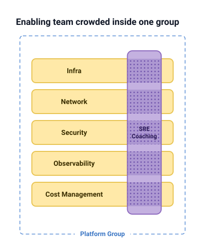
Five lanes, one enabling bar spanning all of them: legible, matches the book. Bar height is
`max(span, 80)` and grows one row's worth per lane it must span — bounded, not crowded, at
today's scale. The open question is what happens past ~8-10 lanes in one group, which this
fixture doesn't reach; flagging as a scale question rather than a defect.
**Acceptance criterion:** an enabling bar spanning N lanes must not force any lane's rendered
height to shrink below its text's wrapped height, for N up to at least 12 (currently unverified
above 5 — this is the gap a follow-up fixture should close).

### 5. `team-owns-streams` — one team, several streams (#24)
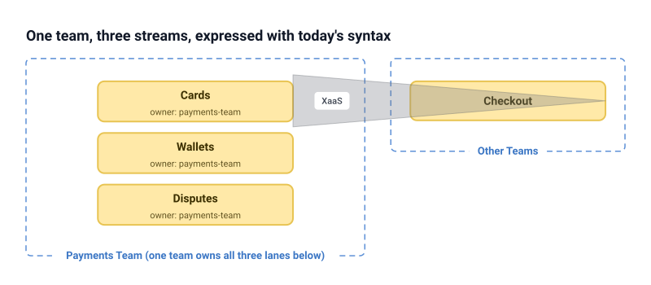
This is #24's exact motivating shape. `note="owner: payments-team"` on three lanes and a group
label reading "Payments Team (one team owns all three lanes below)" are the only levers today,
and neither is visual — a reader has to notice the group boundary is drawn identically to any
other group's boundary and then read three small notes to conclude "one team." The shape reads,
at a glance, as three independent stream-aligned teams.
**Proposed treatment:** cross-reference `docs/team-identity-design.md` on `design/team-identity`
per #24 rather than propose a competing shape here — this fixture's job is to confirm the
problem is real and visual, not textual.
**Acceptance criteria (necessary, not sufficient — full spec belongs in #24):**
1. A reader shown the diagram with no legend must be able to tell, from shape/color alone
   (not by reading notes), which lanes share one team.
2. The treatment must not require duplicating the owning team's name onto every lane's note.

### 6. `alignment-vs-flow` — reporting lines vs. flow topology
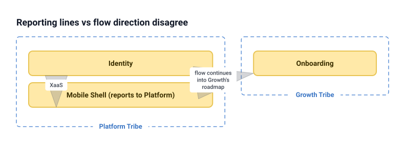
`teamTopology` has exactly one hierarchy primitive (`group`), used simultaneously for "org
reporting structure" and "flow-adjacent containment" in the examples throughout `examples/` and
this gallery. This fixture tried to show a squad that reports to one tribe but whose flow of
change continues into a sibling tribe — and there is no way to draw the disagreement, because
there is no second axis. The render that came out (two overlapping wedges colliding at the
frame gap) is not really "wrong," it's just answering a question ("where does data flow") that
isn't the question this fixture asked ("who reports to whom, and does it match flow").
**This is an open product question, not a bug** — I'm not proposing a fix:
- **OPEN QUESTION:** should `teamtopo` gain a second, orthogonal grouping primitive
  (e.g. `org` blocks for reporting lines, independent of `group` blocks for flow topology), or
  is reporting-line modelling explicitly out of scope (the tool draws flow, not org charts)?
  Both are defensible; I did not choose.

### 7. `nested-three-deep` — tribe > area > stream
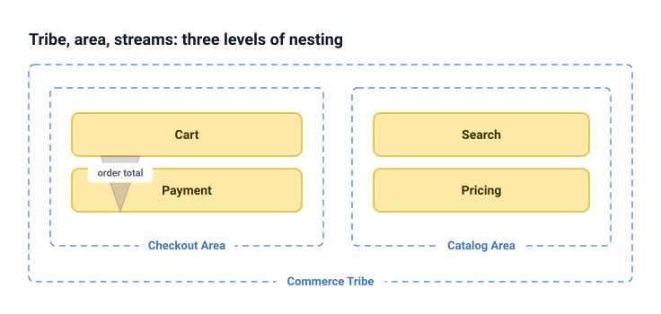
No problems. Three levels of `group` nesting lay out and label correctly (`frame()` recurses
with no special-casing needed). This is the one fixture that just worked, worth keeping as a
regression fixture rather than a design prompt.

### 8. `xaas-matrix` — many-to-many X-as-a-Service
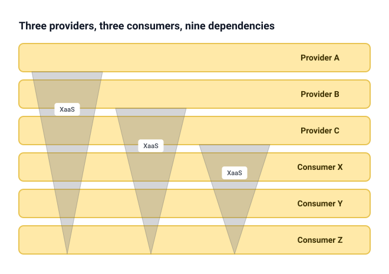
The most quietly dangerous finding in the gallery. Nine `provider --> consumer` lines with no
labels collapse into three wedges — one per provider — because the wedge-grouping key
(`from` + `label`) treats every unlabelled interaction from one provider as the same group, and
the "reaches the farthest, covers what's between" rule then draws a wide sweep from each
provider down through *all three* consumer lanes. A reader sees three broad triangles and
reasonably concludes "each provider serves everything below it," which is true here by
construction but would be false noise for any real matrix where the coverage is partial. The
diagram cannot currently distinguish "I fan out to 3 named consumers" from "I sit above and
provide to whatever's below me."
**Proposed treatment:** an XaaS wedge that does not reach a contiguous, complete run of the
lanes between provider and farthest consumer (i.e., skips a lane) should render as N distinct
narrow wedges or connectors, not one wide one — the collapse-to-one-wedge shortcut should be
gated on "targets form a contiguous block," not just "same provider, same/no label."
**Acceptance criteria:**
1. `provider --> a, c` (skipping `b`) never draws a wedge whose silhouette visually covers `b`.
2. A provider with a genuinely complete, contiguous fan-out (today's common case, e.g.
   `examples/value-streams.tt`'s `core --> storefront, fulfilment, catalog, invoicing`) keeps
   today's single wide wedge (no regression).
3. Given 3 providers × 3 consumers with no shared runs, the render distinguishes 9 relationships
   visibly (count of distinct wedge/connector shapes ≥ 9, not 3).

### 9. `platform-on-platform` — layered platforms
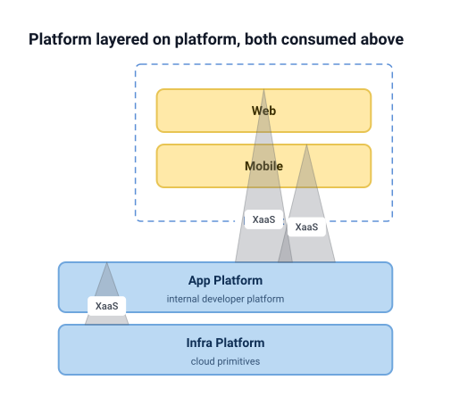
Infra platform stacks below app platform (declaration order), app platform fans out to two
lanes above. The infra→app wedge is short and a little stubby (short vertical distance between
adjacent bars means minimal wedge height) but readable, and the layering intent comes through.
No treatment proposed; flagging the stubby-wedge case as a minor polish item only.

### 10. `enabling-facilitates-leaves` — enabling team, specific leaf teams, several groups
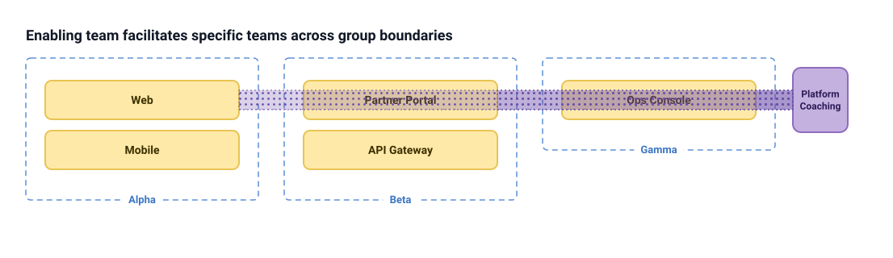
This is the mirror image of the shared-rail feature (rule 8b) and it breaks in exactly the way
that feature is supposed to prevent. `coaching ~~> web`, `~~> portal`, `~~> ops` target three
*lanes*, not their containing groups, so this correctly avoids becoming a rail — but the
column's fallback geometry (`facilitating that cannot cross a lane becomes a dotted band`) draws
one continuous purple dotted band across Alpha, Beta, and Gamma at the shared row height,
because all three targets happen to be each group's first lane. Visually this is indistinguishable
from "coaching facilitates the entire top row of every group," exactly what rule 8b exists to
avoid. Whether a team is deliberately or accidentally facilitating a whole row is currently
undetectable from declared lanes/groups alone; the renderer would need to check "does this band's
vertical span, y-position, and horizontal reach coincide with one lane in every frame it crosses"
and, if so, draw discrete per-target patches instead of a continuous band.
**Acceptance criteria:**
1. An enabling team facilitating specific lanes (not whole groups) in several sibling frames
   renders as discrete per-target patches, never a band spanning the full inter-frame gap.
2. The discrete-patches rendering is visually distinguishable from the rail (rule 8b) so a
   reader can tell "facilitates 3 named teams" from "facilitates 3 whole groups" at a glance.
3. `examples/enabling-groups.tt` (the rail's own reference fixture) is unaffected.

### 11. `large-org` — 32 teams, 6 groups
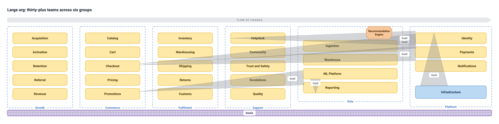
Nothing crashed, nothing clipped, nothing became illegible outright — the base claim ("bounded
growth") holds structurally. But canvas width is `Σ(group widths) + Σ(gaps)`, so it grows
linearly and unboundedly with sibling-group count: 6 groups already need ≈2200px; a
10-15 group real enterprise org would run 4000-6000px wide with no wrap, pagination, or
scroll affordance built into the SVG itself (a consumer has to provide that). Separately, the
DevEx rail spans edge-to-edge because "leftmost-to-rightmost target, covered not excluded" (rule
8b) treats Fulfilment and Support — which DevEx does *not* facilitate — as incidentally covered,
which reads as "DevEx coaches everyone" at this scale even though the source only names 3 of 6
groups.
**Proposed treatment:** this is the "which shapes cluster" case (see ranked list) — the same
rail-and-wedge-collapse fixes above (subsystem rail, contiguous-run gating on wedges) would also
reduce large-org noise, but width-bounding is a distinct, unaddressed problem.
**OPEN QUESTION:** should very wide orgs wrap top-level frames onto multiple rows (a genuine
layout change), or is horizontal scroll/pagination an acceptable consumer-side answer? Both
plausible; not chosen here.
**Acceptance criteria (for width only):**
1. Given N ≥ 8 sibling top-level groups of typical width, canvas width growth is sub-linear in N,
   or the render exposes a documented row-wrap point.

### 12/13. `time-as-is` / `time-to-be` — as-is/to-be pairs and `[soon]`
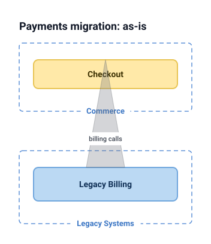
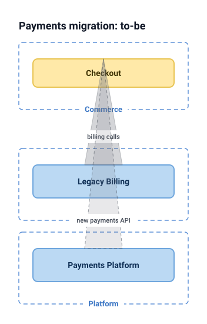
This one mostly works. `[soon]` correctly dashes and fades the new `payments_platform -->
checkout` wedge, visually distinct from the solid `legacy_billing --> checkout` wedge, and the
as-is/to-be pair as two separate files is a fine, low-ceremony way to show a migration (matches
the "Limitations and ideas" section's own "as-is/to-be pairs" idea already on the README's
backlog). One real gap: **there is no way to mark an interaction as retiring/decommissioned** —
only `[soon]` for arriving ones — so a to-be diagram can show what's new but not annotate what's
going away, forcing the two-file convention to carry all of that meaning outside the syntax.
**Acceptance criterion:** `[soon]` semantics are unaffected; if a `[retiring]` (or similar)
attribute is added, it must render as a visually distinct third state (not reusing dashed/faded,
which is already `[soon]`'s signifier) — this is a scoping note, not a commitment to build it.

### 14. `collab-xaas-same-pair` — the actual bug
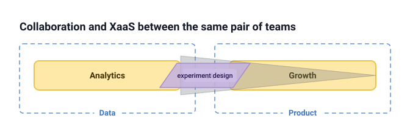
Verified via `--json` and by inspecting the emitted SVG: both interactions parse correctly with
distinct labels (`experiment design`, `event pipeline`). The XaaS wedge and its white label
plate are drawn first (`<g class="tt-xaas">`); the collaboration parallelogram is drawn *after*
(`<g class="tt-collaboration">`) at `rgba(196,177,224,0.85)` opacity, and its polygon
(`261.99,104 → 410.02,144`) fully contains the XaaS label plate's rect
(`299.975,113.125, 88×21.75`). "event pipeline" is 100% present in the DOM and 100% invisible in
every rendered pixel. This is a straightforward z-order/collision bug, not a design question.
**Acceptance criteria:**
1. Given a collaboration and an XaaS interaction between the same ordered pair of teams, both
   labels are simultaneously legible (no label's bounding box is fully covered by the other
   shape) in the rendered SVG.
2. `render()` output for this fixture, diffed before/after a fix, moves only the colliding
   label/shape geometry — no unrelated interaction repositions.
3. A regression test asserts both label texts appear in the SVG with non-overlapping (or
   sufficiently offset) bounding boxes, not just that both `<text>` nodes exist in the DOM.

## Ranked list

**Fix first (frequency × severity × cost):**
1. **`collab-xaas-same-pair` (finding 14).** Highest confidence, lowest cost, real information
   loss (a label vanishes) rather than a stylistic complaint. Any org with a "we also formally
   collaborate with our biggest platform consumer" relationship hits this immediately.
2. **`xaas-matrix` contiguous-run gating (finding 8).** Any fixture with more than one provider
   and more than one shared consumer silently mis-communicates coverage; this is the shape most
   likely to appear the moment someone models a real services matrix, and it currently produces
   confidently wrong pictures rather than obviously ugly ones — the worst failure mode.
3. **Shared-rail-for-subsystems (finding 1) + group-level wedge collapse (findings 2/3).** These
   two cluster into one treatment: "anything shared by several sibling frames gets a rail or a
   collapsed wedge, not a floating box plus N overlapping connectors." Fixing this removes the
   platform-block-avoidance tax (finding 2/3) at the same time, which is probably the single
   highest-leverage change since it's the one Ryan already suspected going in.

**Cluster into one treatment:**
- Findings 1, 2/3, and 10 are all "a shared thing crossing several sibling frames currently
  degrades to either a floating box, N overlapping wedges, or an indistinguishable band" — one
  generalized "cross-frame shared element" rule (rail when it spans whole frames, discrete
  patches when it targets specific lanes inside them) would resolve all three at once.
- Finding 8 (xaas-matrix) and finding 11's wedge noise share root cause (wedge collapse rules
  don't check contiguity) and should be fixed together.

**Needs a design spec, not a quick fix:**
- Finding 5 (`team-owns-streams`) is #24's problem exactly; cross-reference
  `docs/team-identity-design.md` on `design/team-identity` rather than duplicate it here.
- Finding 6 (`alignment-vs-flow`) is a genuine open product question (second hierarchy axis for
  reporting lines vs. flow) that needs Ryan's decision before any shape work starts.
- Finding 11's canvas-width-bounding question (row-wrap vs. consumer-side scroll) is an
  architectural layout decision, not a bug fix.

## What surprised me enough to add beyond the brief

Nothing needed a fifteenth fixture — the fourteen built covered every numbered case plus, as it
turned out, one outright bug (14) and one open product question (6) that the brief's phrasing
("explore how we should better build and place the shapes") explicitly left room for.
